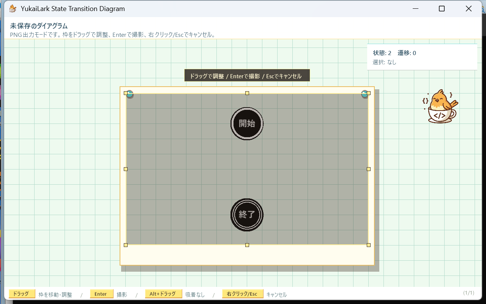

# 開発日誌 2026-06-24
## 今日進んだこと
- `Ctrl + P` 直後に、図全体を包むPNG出力範囲枠を自動表示するようにした。
- PNG出力範囲枠は、枠内ドラッグで移動、辺・角ドラッグでサイズ調整できるようにした。
- 空の図では、ビューポート中央に既定サイズのPNG出力範囲枠を表示するようにした。
- `Enter` でPNG保存に成功したあと、白いフラッシュと写真風プレビューを短く表示するようにした。
- 下部ヘルプと使い方説明書を、自動枠を調整して撮影する流れに更新した。
- Visual Studio の Codex Chat がパス文字列まわりで落ちる件を調べ、Windows イベントログ上で `CodexVsix.UI.MarkdownRenderer.CreateInlineCode` と `Path.IsPathRooted` の例外を確認した。
- Codex Chat のパス文字列フリーズ回避策を運用メモにまとめ、repo ローカル skill とインストール用スクリプトを追加した。
## スクリーンショット

## 確認したこと
- `dotnet build .\YukaiLarkStateTransitionDiagram.slnx` は警告 0、エラー 0 で成功した。
- PNG出力の詳細計画と結果は [PNG出力自動枠撮影演出 実装計画 2026-06-24](PNG出力自動枠撮影演出_実装計画_2026-06-24.md) に記録済み。
- Codex Chat のフリーズ回避策は [Codex Chat パス文字列フリーズ回避](../運用/CodexChatパス文字列フリーズ回避.md) に記録済み。
## 次にやるなら
- ［開始マーク］を新規ダイアグラムに最初から 1 個だけ固定配置する。
- ［開始マーク］の追加・削除ポリシーを整理する。
- ［開始マーク］から出る遷移を 1 本に制限する。
- ［終了マーク］から出る遷移を禁止する。
- 画面上の残りの［開始ノード］/［終了ノード］表記がないか、軽く見直す。
- Codex Chat 側の不具合が直るまでは、Windows パスをそのままインラインコードで返さない運用を続ける。