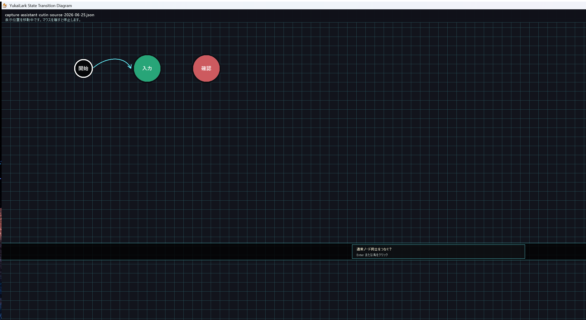
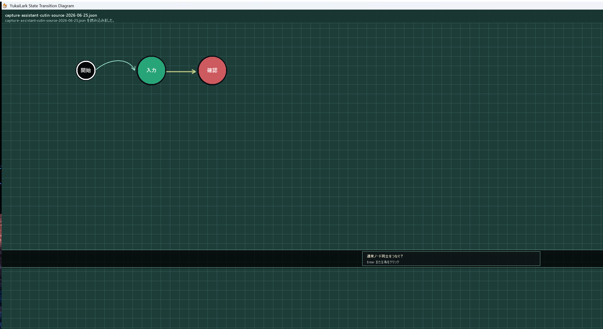
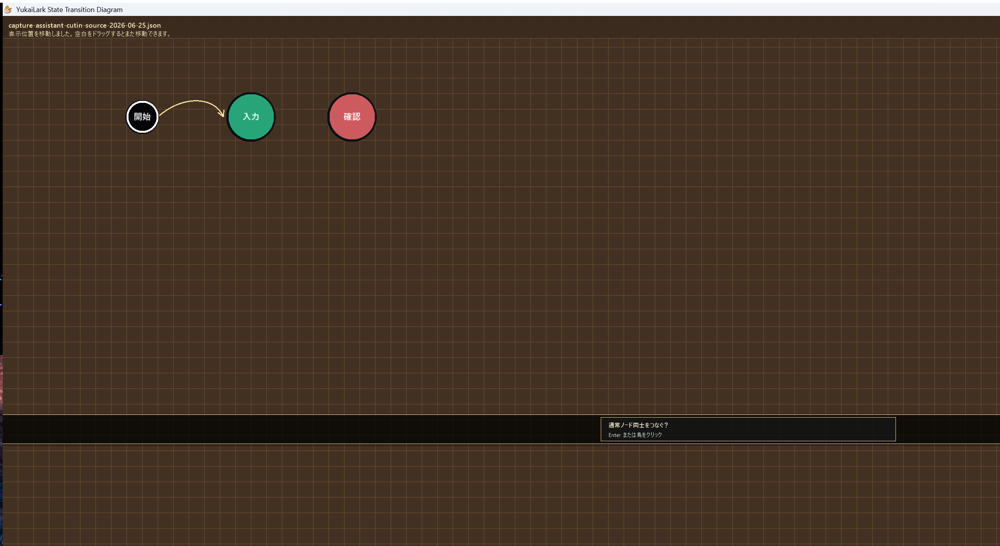

# 開発日誌 2026-06-25
## 今日進んだこと
- ユカイラークの吹き出しを、短い台詞だけの小さな表示へ整理した。
- 操作説明は、半透明の黒帯カットインとして画面下寄りに分離した。
- 通常アシストの説明は1行、作図完了時の説明とヒントは2行で出すようにした。
- カットインの位置を少し下へ移し、状態遷移図の作業領域を邪魔しにくくした。
- マウスカーソルの見た目と、表示位置をスライドして整える操作まわりを進めた。
- テーマを切り替えた状態でも、黒帯カットインが画面の雰囲気に馴染むことを撮影で確認した。

## スクリーンショット

## 確認したこと
- `dotnet build .\YukaiLarkStateTransitionDiagram.slnx` は警告 0、エラー 0 で成功した。
- 黒帯カットインの撮影では、Gaming、Mint、Amber の3テーマで見た目を確認した。
- 撮影用に一時的な起動補助を使ったが、撮影後に `Game1.cs` は元へ戻し、最終差分には残していない。

## 次にやるなら
- ［開始マーク］を新規ダイアグラムに最初から 1 個だけ固定配置する。
- ［開始マーク］から出る遷移を 1 本に制限する。
- ［終了マーク］から出る遷移を禁止する。
- ユカイラークのカットイン位置とインスペクター表示が重ならないか、画面サイズ違いで見直す。
